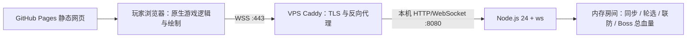

# 卫戍协议 · 联机扩展

联机直接使用本仓库当前单机的游玩代码和原生界面。商店、手牌、装备拖放、部署朝向、技能、地形特效、干员档案与伤害报告均来自 `dist/native-play.js`，没有另一个联机棋盘或商店实现。网页计算战斗，Node.js 服务同步房间与公共规则。

## 运行架构



浏览器执行原单机的商店、部署、战斗与绘制，发送结果和只读视角快照。Node.js 校验玩家身份、房间阶段、任务和重复消息，协调独立生命、串行联防、公共决策与共享 Boss；服务端不重新演算每次攻击，不提供完整防作弊。

GitHub Pages 只托管静态网页。VPS 由 Caddy 提供 HTTPS/WSS 和自动续证，转发到只监听 本机回环地址的 8080 端口 的 Node 服务；服务端也能分发联机网页及允许访问的游戏资源。
房间、恢复点与视角快照存在进程内存中，没有数据库或账号系统，重启会清空。单机与联机用同一源码构建，网页与服务器通过规则指纹拒绝不匹配版本。

当前生产使用 systemd `garrison-multiplayer`、目录 `/opt/garrison-protocol`，最多 10 房、56 连接，内存硬限 768 MiB。每 6 小时自动同步上游只更新静态网站，VPS 需单独维护。

从零安装、systemd、Caddy、限流配置、版本验证、更新和回退见 [服务端部署步骤](../docs/MULTIPLAYER_SERVER_DEPLOYMENT.md)；安全边界见 [服务端安全说明](../docs/MULTIPLAYER_SERVER_SECURITY.md)。

## 运行与构建

使用 Node.js 22+（生产为 24.21.0）。在仓库根目录：

```bash
npm ci --prefix multiplayer
npm run build
npm start --prefix multiplayer -- --max-rooms 10 --max-connections 56
```

默认最多 10 个房间。可用 `npm start --prefix multiplayer -- --max-rooms 10 --max-connections 56` 或 `MAX_ROOMS=10` 配置容量；消息频率、流量参数与架构/防护说明见[服务端安全文档](../docs/MULTIPLAYER_SERVER_SECURITY.md)。

访问 `http://服务端IP:8080/`，输入 IP/端口，创建房间后分享房间号。HOST/PORT 可以覆盖监听地址；本机 HTTP 页面能使用 WS，HTTPS 页面必须使用 WSS。

```bash
npm run build
npm run build:pages --prefix multiplayer
```

构建生成 `.pages/`，本仓库 `.github/workflows/pages.yml` 独立部署这个目录，所有任务固定 Ubuntu 24.04 LTS。**不再由博客构建或复制游戏**。具体站点地址以仓库 Pages 设置为准，可使用账号默认域名或绑定的自定义域名。路径是仓库名，`/ark` 不再使用。

网站暂保留现有默认联机地址，使用端口 `443`、WSS；文档不记录具体部署域名或 IP。静态清单记录网页规则指纹；服务端指纹不一致时拒绝入房，避免前后端玩法不一致。换自有服务域名可在构建时设置 `MULTIPLAYER_PUBLIC_URL=wss://域名/socket`。

## 如何复用单机

原 `dist/` 源码不改。`scripts/build-native-ui.mjs` 在每次构建/启动/测试时读取当前源码，自动生成以下入口（生成物不提交）：

- `client/native-play.generated.js`：原 UI 主体只调整 ESM 导入路径和冻结波次表的预览参数，再追加 `client/native-extension.js`。后者仅接管挂载会话、网络动作、存档隔离、只读视角与双画布，直接调用原 `render/action/draw/updateHud/showResult`。
- `generated/native-{session,economy,battle,waves}.js`：从同一单机源码生成，只注入三个边界接口——传入房主冻结的波次表、备战效果后等待全员就绪、战斗实例工厂。备战卫戍/盟约/策略/S.E.E.S.、鸭爵波次与追加悬赏仍由原代码执行。
- `client/session.js`：只负责独立生命、漏怪来源账本、串行联防、悬赏归属、公共 Boss 血量和联网恢复；战斗算法继承上述原生模块。
- `client/presentation.js`：传输表现状态，用原存档恢复接回原战斗对象，然后交给原绘图函数。队友对象禁止 perform/tick，快照不会参与服务端规则结算。
- `client/app.js`：只显示连接/房间、本局禁用预览、头像/表情、策略互斥与六项轮选；不实现游戏商店、部署、棋盘或战报。

后续修复单机只需修改原模块并重新构建，联机自动带入。构建检查所有注入点：上游接口改变会明确失败，需核对接线；不能无条件承诺任意未来重构无需适配。不要编辑生成文件。生成器属于联机目录，单机的原构建、入口与存档键完全独立。

## 已确认联机规则

- 2–4 人；头像上传/裁切，固定表情广播。房主点击「开始游戏」后先展示本局固定的盟约禁用与干员名单，全员确认后依次选策略且不重复。
- 游玩阶段的队友视角与表情放在可拖动悬浮框内，位置在本地保留、窗口缩小时自动限制在可见范围；表情在发送者头像旁弹出，5 秒后消失。表情使用 [BWIKI 游戏表情一览](https://wiki.biligame.com/arknights/游戏表情一览) 的分类图片，默认打开盟约下半。悬浮框宽 300px，表情按钮 48×48px、每行 5 个，网格最高 154px，超出滚动。
- 公共悬赏六项都是已准入精英，装备与战术也各六项；多名玩家依次选，不重复。
- 独立生命，归零淘汰。道中都结束后才联防；最快至多两名完美玩家先 C 后 D 接力。
- 联防敌人刷新出生状态，友方保留上一战全部状态；最终按原漏怪来源和敌人扣血值扣生命，每名每轮最多 10 点；悬赏由实际击倒者领取。
- 最终 Boss 原单机默认血量（原表 ×0.75）再乘 3/5/7，按开局 2/3/4 人固定；地图独立，共享剩余血量。
- 准备期可看队友；联防自动看当前兜底者，两名时左右展示，右边为等待/结束状态。
- 原单机难度、回合日程、商店和技能规则继续保留；开战全员准备，固定 1×，不允许独立暂停。刷新短期续接，淘汰后可观战。

表情图片由维护脚本 `python3 multiplayer/scripts/import-wiki-emotes.py` 手动导入到 `client/emotes/`，来源 URL、文件名与页面 revision 保留在 `shared/emotes.js`。当前 revision 337086：7 类可用、57 张图片；去除重复历史预览，保留其中不重复的旧表情。`duel` 分类在来源页无图片，不添加虚构素材。图片随静态站点发布，运行及 CI 构建不请求 BWIKI；网络只传固定表情 ID，服务端拒绝外部 URL。素材版权归原权利人。


## 验证

```bash
npm test --prefix multiplayer
npx --prefix multiplayer playwright install chromium
npm run test:browser --prefix multiplayer
npm run test:pages --prefix multiplayer
```

单元测试包含原生代码复用、准备期一致性、只读视角、联机规则、上游合并/冲突撤销、房间容量/消息限流以及表情分类/素材白名单。四浏览器使用原生商店两次点击确认、手牌拖放和朝向部署，测试禁用确认、浮框拖动/位置保留、分类切换/表情图片加载/5 秒消失、联防分屏、刷新续接、六选与公共 Boss。战斗案例使用真实引擎和受控快进，不代表所有回合的人工长局验收。静态测试验证独立 `/garrison-protocol/` 子路径与跨服务连接。

历史单机检查：全量测试有 29 项失败；没有因联机更新重跑全量并宣称全部通过。原生相关 54 项回归当时 53 项通过，S.E.E.S. 装备池的源码字符串断言失败（原测试查找 `itemAllowed(i,this)`）；该失败发生在未改动的原源码。

截至 2026-10-02，最近一次联机单元测试 42/42 通过；四浏览器完整流程、Pages 子路径与图片表情广播通过。表情框缩小后另验证静态入口与公网按钮尺寸。原项目构建成功，公网网页与服务端规则指纹一致。这是已运行的检查记录，不代表人工完整长局或全部原作机制验收。
